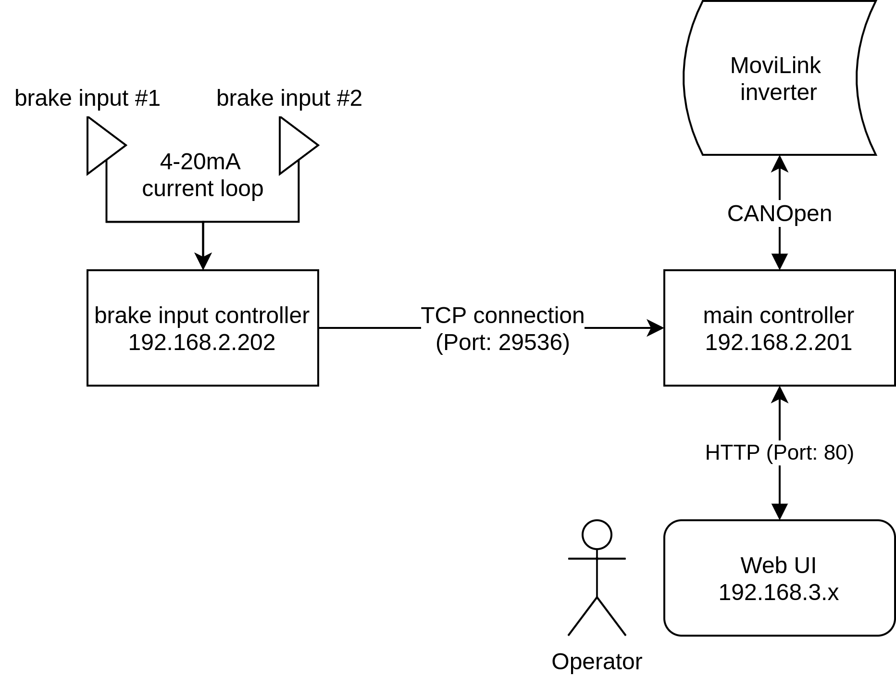

# Operation
## Hardware
The software was designed to run on standard ARM based hardware with focus on Raspberry Pi support.

## Architecture
The application consists of two parts, which are usually running on dedicated boards each.

1. The **main controller** is serving the UI, has a CANOpen connection to the inverter and is handling the main application logic

2. The **brake input** receiver reads the analog inputs and sends them via TCP connection to the main controller. 



## Execution
Both controller parts are contained in the single controller binary. If called without any argument, the main mode is execute. For the brake input part --brake_input needs to be appended.
````bash
controller [--brake_input]
````