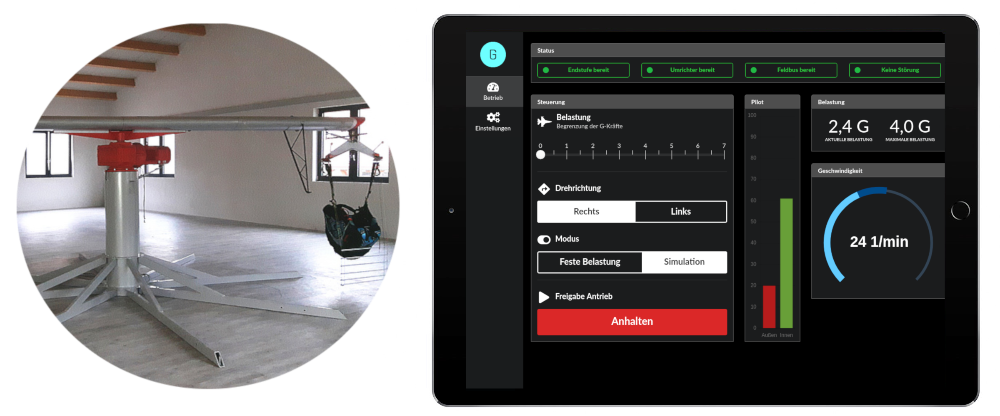

# G-Force trainer   
An alternative controller software for the G-Force trainer engineered initially by [Thomas Grabner](http://www.gforce-trainer.com).

## Features
* **Simulation mode**: Full support of both brake inputs to imitate paragliding spirals
* **Static mode**: Constant rotation speed for g-force stress training
* **Web interface**: Real time browser user interface with focus on tablet devices
* **Configuration**: UI for adjusting parameters like brake input limits, etc.

## Usage
The software is licensed under GNUv3 and is therefore free to use, for more details see [the license](LICENSE).

Technical details are described in the [operational section](OPERATION.md).

## Contribution

Contribution is highly welcome. Please feel free to create issues and pull requests. 

For development guidelines please consult the [development section](DEVELOPMENT.md).

